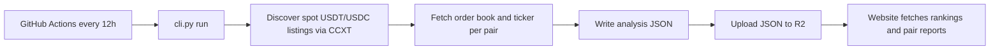

# Crypto Liquidity Audit — open-source data pipeline

This repository produces the analysis JSON that powers [crypto-liquidity-audit.drakkar.software](https://crypto-liquidity-audit.drakkar.software/): exchange rankings, per-pair liquidity reports, and the snapshot timestamp shown on each report.

For what each metric means and how scores are calculated, see the live [Methodology](https://crypto-liquidity-audit.drakkar.software/methodology) page. This document explains **when and how** that data is refreshed, and **how to reproduce** a run locally.

## How published data is updated

Production data is refreshed automatically every **12 hours** by [`.github/workflows/update-analysis-data.yml`](.github/workflows/update-analysis-data.yml). The workflow can also be triggered manually from the GitHub Actions tab.



Each run follows these steps:

1. **Discover listings** — For each configured exchange (currently **MEXC** and **BitMart**), the pipeline loads active **spot** markets quoted in **USDT** or **USDC** via [CCXT](https://github.com/ccxt/ccxt).
2. **Analyze each pair** — For every non-delisted listing, the pipeline fetches one **visible order-book snapshot** (top 50 levels) and the **24h ticker**, then computes spread, depth, slippage, health labels, and the 0–100 liquidity score. See [`fetch_pair_metrics.py`](liquidity_audit/application/shared/fetch_pair_metrics.py).
3. **Write JSON** — Results are written under `data/analysis/` (see [Published artifacts](#published-artifacts) below). A run manifest records start time, completion time, pair counts, and any failures.
4. **Publish** — All `*.json` files under `data/analysis/` are synced to R2. The website reads this published JSON at runtime; it does not call exchanges directly.

### What the website uses

| Source | Used for |
|--------|----------|
| `rankings/{exchange}.json` | Home-page rankings table, pair search, sitemap |
| `pairs/{exchange}/{slug}.json` | Individual token report pages (`/pairs/mexc/SOL_USDT`, etc.) |
| `manifest.json` | Run metadata (not shown on the site today, but published for transparency) |

The rankings **table** shows the top 20 pairs with at least **$1,000** in 24h quote volume (`rankings_min_volume_quote` in the rankings JSON). The rankings file also lists every analyzed pair (including lower-volume listings) so search can find them. Each analyzed pair has a full report JSON regardless of volume.

### Timestamps

- Each pair report includes `raw.fetched_at` — the UTC time that order book and ticker were fetched.
- Rankings files include `updated_at` for the exchange summary.
- `manifest.json` records `run_started_at` and `run_completed_at` for the full pipeline run.

### Limitations

Each report reflects a **single point-in-time snapshot** of the visible CEX spot order book. The pipeline does not detect wash trading or judge the quality of reported volume. Thin ask liquidity can make large buys unfillable even when bid depth looks healthy. Independent analysis — not investment advice.

## Published artifacts

All paths are relative to `data/analysis/` after a run ([`analysis_store.py`](liquidity_audit/infrastructure/analysis_store.py)).

**`manifest.json`** — Metadata for the last completed run: exchanges covered, number of pairs analyzed, delisted/skipped counts, and any pair-level failures.

**`rankings/{exchange}.json`** — Per-exchange summary used by the home page. Each row has `symbol`, `score_100`, `volume_quote` (0 when the exchange ticker returns no quote volume), and `rank` (assigned only for volume-eligible pairs). The file also includes `rankings_min_volume_quote` so consumers know the volume threshold.

**`pairs/{exchange}/{slug}.json`** — Full analysis payload for one pair. The URL slug replaces `/` with `_` (e.g. `SOL/USDT` → `SOL_USDT.json`). This is the source for everything on a token report page: score breakdown, health dashboard, peer comparison, investor simulator, and improvement sections.

## Reproducing the analysis

You can rerun the pipeline locally to verify that the published numbers match what this code produces.

**Requirements:** Python 3.13+

**Setup:**

```sh
pip install --prefer-binary -r requirements.txt
cp config.example.json config.json
```

**Full run** (discovers listings, fetches live order books, writes `data/analysis/`):

```sh
python cli.py --config config.json run
```

**Offline re-score** (rebuilds analysis JSON from cached raw blocks in existing pair files — no exchange fetch):

```sh
python cli.py --config config.json re-evaluate-data
```

| Command | What it does |
|---------|--------------|
| `run` | Full pipeline: discover listings, analyze health, write JSON |
| `re-evaluate-data` | Recompute scores and rankings from stored raw metrics |

**Verify** against the test suite:

```sh
pip install -r dev_requirements.txt
python -m pytest tests/ -v
```

**Preview the website locally** — copy analysis output into the SPA and start the dev server. See [`website/README.md`](website/README.md) for `npm run sync:data`, `npm run dev`, and production deploy details.

## Further reading

- [Methodology](https://crypto-liquidity-audit.drakkar.software/methodology) — metric formulas and scoring on the live site
- [`website/README.md`](website/README.md) — React app, Cloudflare Worker deploy, R2 CORS, analytics
- [`.github/workflows/update-analysis-data.yml`](.github/workflows/update-analysis-data.yml) — scheduled data refresh
- [`.github/workflows/tests.yml`](.github/workflows/tests.yml) — CI tests and website deploy on push to `master`
